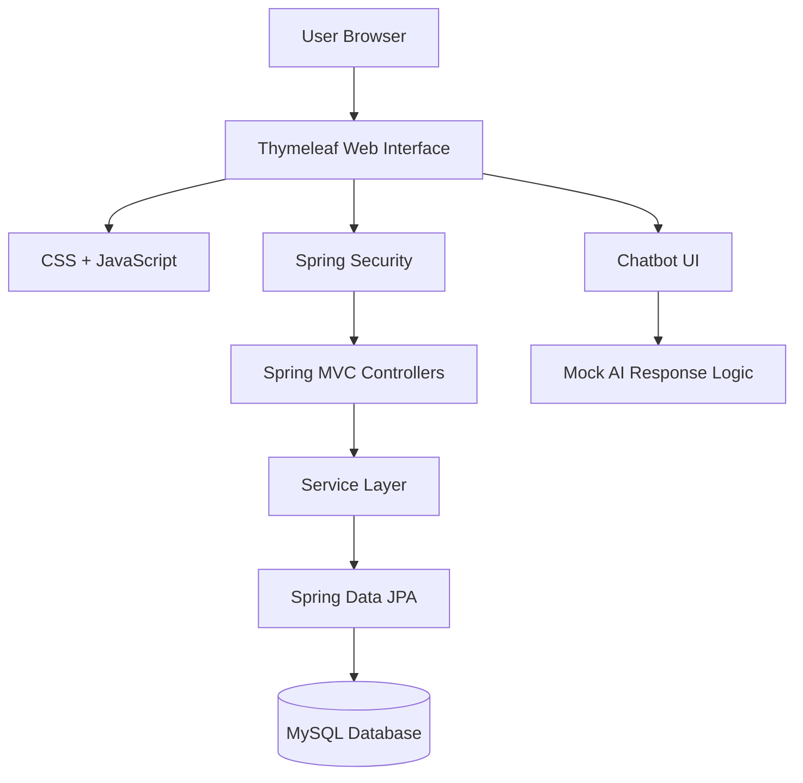
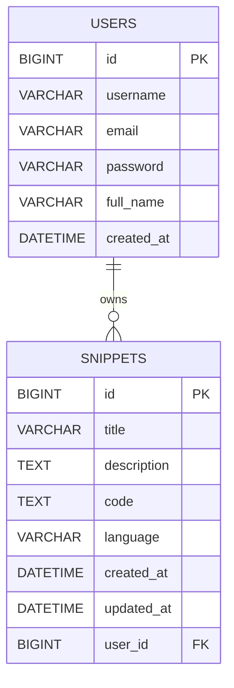

<div align="center">

# 💻 Code Snippet Repository

### Secure Code Management, Smart Search & Developer Assistance

<p>
  <strong>Create. Organize. Search. Manage. Improve your code snippets.</strong>
</p>

<p>
  
  
  
  
  
  
</p>

</div>

---

## 📌 Overview

**Code Snippet Repository** is a full-stack web application designed for developers to securely store, organize, search, and manage reusable code snippets.

The platform combines:

* Secure user authentication
* Code snippet CRUD operations
* Programming language categorization
* Keyword-based search
* User dashboard analytics
* AI-style coding assistance
* Responsive dark-themed interface
* MySQL-based persistent storage

The application is built using **Spring Boot, Spring Security, Spring Data JPA, Thymeleaf, and MySQL**.

It also includes an extensible chatbot interface capable of assisting developers with code formatting, explanation, optimization, debugging, and code-generation-style requests.

> **Note:** The current chatbot implementation uses mock AI responses and is structured so that a real LLM or OpenAI-based service can be integrated later.

---

# ✨ Key Features

## 🔐 User Authentication

The application provides a secure account system using **Spring Security**.

Users can:

* Register a new account
* Login securely
* Access authenticated pages
* Maintain their personal snippet collection
* Logout from the application

Passwords are protected using secure password encoding.

---

## 📝 Code Snippet Management

Users can create and manage reusable code snippets.

Supported operations include:

```text
Create
  ↓
View
  ↓
Edit
  ↓
Delete
```

Each snippet can contain:

* Title
* Description
* Programming language
* Source code
* Creation timestamp
* Updated timestamp
* Associated user

---

## 🏷️ Programming Language Categorization

Snippets can be organized according to programming language.

Supported categories include:

```text
Java
Python
JavaScript
HTML
CSS
SQL
```

This helps developers maintain an organized personal code library.

---

## 🔍 Smart Search

The application provides keyword-based snippet search.

Users can search using:

* Snippet title
* Description
* Code content

Example:

```text
User Search
     ↓
Enter Keyword
     ↓
Snippet Repository
     ↓
Matching Snippets
```

---

## 📊 Dashboard Analytics

The dashboard provides a centralized view of the user's snippet activity.

It can display information such as:

* Stored snippets
* Recent activity
* Snippet statistics
* Quick navigation
* Recently created content

This allows users to manage their code collection from one interface.

---

## 🤖 Developer Chatbot Assistant

The application includes a chatbot interface accessible from the bottom-right corner of the UI.

The assistant is designed to help with:

### Code Formatting

Improve indentation and code readability.

### Code Explanation

Understand unfamiliar or complex code.

### Code Optimization

Suggest cleaner or more efficient approaches.

### Debugging Assistance

Help identify possible programming errors.

### Code Generation

Provide boilerplate-style code assistance.

Current architecture:

```text
User
 ↓
Chatbot UI
 ↓
chatbot.js
 ↓
Chatbot Logic
 ↓
Mock AI Response
```

The chatbot layer can later be connected to a real AI model or external AI service.

---

## 🎨 Modern Dark UI

The frontend uses a developer-focused dark interface inspired by GitHub.

The application includes:

* Clean layouts
* Dark theme
* Responsive navigation
* Developer-friendly styling
* Mobile-compatible pages

---

## 📱 Responsive Design

The interface is designed to work across:

```text
Desktop
Laptop
Tablet
Mobile
```

---

# 🖥️ Application Preview

## Home / Landing Interface


---

## Application Interface


---

## Snippet Management


---

## Dashboard


---

## AI Chatbot


---

## Snippet Interface


---

## Repository Interface


---

# 🏗️ System Architecture



---

# 🔄 Application Workflow

```text
User Opens Application
          ↓
Register Account
          ↓
Login
          ↓
Spring Security Authentication
          ↓
Dashboard
          ↓
Create Code Snippet
          ↓
Select Programming Language
          ↓
Enter Description + Code
          ↓
Spring Boot Controller
          ↓
Service Layer
          ↓
Spring Data JPA
          ↓
MySQL Database
          ↓
View / Search / Edit / Delete
          ↓
Manage Personal Snippet Repository
```

Optional chatbot workflow:

```text
Developer
    ↓
Open Chatbot
    ↓
Enter Coding Question
    ↓
Chatbot JavaScript
    ↓
Response Logic
    ↓
Developer Assistance
```

---

# 🧰 Technology Stack

| Layer             | Technology                 |
| ----------------- | -------------------------- |
| Backend Language  | Java 17                    |
| Backend Framework | Spring Boot 3.2.0          |
| MVC Framework     | Spring MVC                 |
| Security          | Spring Security            |
| ORM               | Hibernate                  |
| Data Access       | Spring Data JPA            |
| Database          | MySQL                      |
| Template Engine   | Thymeleaf                  |
| Frontend          | HTML5                      |
| Styling           | CSS3                       |
| Client Logic      | JavaScript                 |
| UI Theme          | GitHub-inspired Dark Theme |
| Build Tool        | Maven                      |
| AI Interface      | JavaScript Chatbot         |
| Current AI Logic  | Mock Responses             |

---

# 🗂️ Project Structure

```text
code-snippet-repository/
│
├── src/
│   │
│   ├── main/
│   │   │
│   │   ├── java/
│   │   │   └── com/snippets/
│   │   │       │
│   │   │       ├── CodeSnippetManagerApplication.java
│   │   │       │
│   │   │       ├── controller/
│   │   │       │   ├── HomeController.java
│   │   │       │   ├── UserController.java
│   │   │       │   ├── SnippetController.java
│   │   │       │   └── DashboardController.java
│   │   │       │
│   │   │       ├── service/
│   │   │       │   ├── UserService.java
│   │   │       │   ├── SnippetService.java
│   │   │       │   │
│   │   │       │   └── impl/
│   │   │       │       ├── UserServiceImpl.java
│   │   │       │       └── SnippetServiceImpl.java
│   │   │       │
│   │   │       ├── repository/
│   │   │       │   ├── UserRepository.java
│   │   │       │   └── SnippetRepository.java
│   │   │       │
│   │   │       ├── entity/
│   │   │       │   ├── User.java
│   │   │       │   └── Snippet.java
│   │   │       │
│   │   │       └── config/
│   │   │           └── SecurityConfig.java
│   │   │
│   │   └── resources/
│   │       │
│   │       ├── templates/
│   │       │   ├── index.html
│   │       │   ├── login.html
│   │       │   ├── register.html
│   │       │   ├── dashboard.html
│   │       │   │
│   │       │   └── snippets/
│   │       │       ├── list-snippets.html
│   │       │       └── create-snippet.html
│   │       │
│   │       ├── static/
│   │       │   │
│   │       │   ├── css/
│   │       │   │   └── github-dark.css
│   │       │   │
│   │       │   └── js/
│   │       │       └── chatbot.js
│   │       │
│   │       └── application.properties
│   │
│   └── test/
│
├── pom.xml
└── README.md
```

---

# ⚙️ Prerequisites

Install the following before running the application locally.

```text
Java JDK 17+
MySQL 8.0+
Maven 3.6+
Git
```

Recommended IDE:

```text
Spring Tool Suite (STS)
        OR
IntelliJ IDEA
```

Verify Java:

```bash
java -version
```

Verify MySQL:

```bash
mysql --version
```

Verify Maven:

```bash
mvn -version
```

---

# 🚀 Running the Project Locally

## 1. Clone the Repository

```bash
git clone https://github.com/yourusername/code-snippet-repository.git
```

Enter the project directory:

```bash
cd code-snippet-repository
```

---

## 2. Configure MySQL

Start the MySQL server.

Login:

```bash
mysql -u root -p
```

Create the database:

```sql
CREATE DATABASE snippet_db;
```

Verify:

```sql
SHOW DATABASES;
```

---

## 3. Configure Application Properties

Open:

```text
src/main/resources/application.properties
```

Configure the database:

```properties
spring.datasource.url=jdbc:mysql://localhost:3306/snippet_db?useSSL=false&serverTimezone=UTC
spring.datasource.username=root
spring.datasource.password=YOUR_MYSQL_PASSWORD
spring.datasource.driver-class-name=com.mysql.cj.jdbc.Driver
```

JPA configuration:

```properties
spring.jpa.hibernate.ddl-auto=update
spring.jpa.show-sql=true
spring.jpa.properties.hibernate.dialect=org.hibernate.dialect.MySQLDialect
```

Server configuration:

```properties
server.port=8080
```

Thymeleaf configuration:

```properties
spring.thymeleaf.prefix=classpath:/templates/
spring.thymeleaf.suffix=.html
spring.thymeleaf.cache=false
```

Logging:

```properties
logging.level.com.snippets=DEBUG
```

> Do not commit real database passwords or other sensitive credentials to a public GitHub repository.

---

## 4. Build the Application

### Windows

Using Maven Wrapper:

```bash
mvnw clean install
```

### Linux / macOS

```bash
./mvnw clean install
```

Using locally installed Maven:

```bash
mvn clean install
```

---

## 5. Run the Application

### Option A — Spring Tool Suite

1. Open **STS**
2. Select **File → Import**
3. Choose **Existing Maven Projects**
4. Select the project folder
5. Finish the import
6. Right-click the project
7. Select **Run As → Spring Boot App**

---

### Option B — Command Line

```bash
mvn spring-boot:run
```

---

### Option C — IntelliJ IDEA

1. Open IntelliJ IDEA
2. Select **File → Open**
3. Select the project folder
4. Wait for Maven dependencies to load
5. Open `CodeSnippetManagerApplication`
6. Run the application

---

# 🌐 Access the Application

After starting Spring Boot, open:

```text
http://localhost:8080
```

---

# 🎯 Application Routes

| Page           | URL                                | Description              |
| -------------- | ---------------------------------- | ------------------------ |
| Home           | `/`                                | Application landing page |
| Register       | `/register`                        | Create a new account     |
| Login          | `/login`                           | Sign in                  |
| Dashboard      | `/dashboard`                       | User dashboard           |
| My Snippets    | `/snippets`                        | View snippets            |
| Create Snippet | `/snippets/create`                 | Add a new snippet        |
| Edit Snippet   | `/snippets/edit/{id}`              | Modify a snippet         |
| Search         | `/snippets/search?keyword={query}` | Search code snippets     |

---

# 🔐 Authentication Flow

```text
New User
   ↓
Registration
   ↓
User Details
   ↓
Password Encoding
   ↓
MySQL
   ↓
Login
   ↓
Spring Security
   ↓
Authenticated Session
   ↓
Protected Application Pages
```

---

# 🗄️ Database Design

The application primarily contains two entities:

```text
USER
 │
 │ 1
 │
 │
 │ *
 ↓
SNIPPET
```

A user can store multiple code snippets.

---

## Users Table

```sql
CREATE TABLE users (
    id BIGINT PRIMARY KEY AUTO_INCREMENT,
    username VARCHAR(255) UNIQUE NOT NULL,
    email VARCHAR(255) UNIQUE NOT NULL,
    password VARCHAR(255) NOT NULL,
    full_name VARCHAR(255),
    created_at DATETIME
);
```

---

## Snippets Table

```sql
CREATE TABLE snippets (
    id BIGINT PRIMARY KEY AUTO_INCREMENT,
    title VARCHAR(255) NOT NULL,
    description TEXT,
    code TEXT NOT NULL,
    language VARCHAR(255) NOT NULL,
    created_at DATETIME,
    updated_at DATETIME,
    user_id BIGINT,
    FOREIGN KEY (user_id) REFERENCES users(id)
);
```

---

# 📊 Database Relationship



---

# 🤖 Chatbot Architecture

The chatbot is implemented as a frontend coding assistant.

```text
Developer
    ↓
Chatbot Button
    ↓
Chat Window
    ↓
JavaScript
    ↓
User Prompt Processing
    ↓
Mock Response Logic
    ↓
Coding Assistance
```

Supported assistance categories include:

```text
Code Formatting
Code Explanation
Optimization
Debugging
Code Generation
```

The current implementation does **not require an external AI API**.

A real AI provider can be connected later by replacing or extending the current response layer.

---

# 🧪 Testing

Recommended application testing flow:

```text
Register
   ↓
Login
   ↓
Open Dashboard
   ↓
Create Snippet
   ↓
Save Snippet
   ↓
View Snippets
   ↓
Edit Snippet
   ↓
Search Snippets
   ↓
Delete Snippet
   ↓
Open Chatbot
   ↓
Test Coding Assistance
```

---

## 1. Register a New User

Navigate to:

```text
/register
```

Enter:

* Full name
* Username
* Email
* Password

Click:

```text
Create Account
```

---

## 2. Login

Navigate to:

```text
/login
```

Enter your credentials and sign in.

---

## 3. Create a Snippet

Open:

```text
Dashboard → New Snippet
```

Enter:

* Title
* Description
* Programming language
* Source code

Then save the snippet.

---

## 4. Manage Snippets

Navigate to:

```text
/snippets
```

Users can:

```text
View
Edit
Delete
Search
```

their stored snippets.

---

## 5. Search Snippets

Use the search box and enter a keyword.

Example:

```text
binary search
```

The application filters matching snippets.

---

## 6. Test the Chatbot

Click the:

```text
🤖 Chatbot Icon
```

Try requests related to:

* Code formatting
* Code explanation
* Debugging
* Optimization
* Boilerplate generation

---

# 🐛 Troubleshooting

## MySQL Connection Error

Possible error:

```text
Cannot load driver class: com.mysql.cj.jdbc.Driver
```

Check that the MySQL dependency is available in `pom.xml`.

Then run:

```bash
mvn clean install
```

---

## Database Not Found

Possible error:

```text
Unknown database 'snippet_db'
```

Create the database:

```sql
CREATE DATABASE snippet_db;
```

---

## Port 8080 Already in Use

Possible error:

```text
Web server failed to start.
Port 8080 was already in use.
```

Change the application port:

```properties
server.port=8081
```

Then access:

```text
http://localhost:8081
```

---

## Compilation Errors

Clean the project:

```bash
mvn clean
```

Rebuild:

```bash
mvn clean install
```

Then refresh the Maven project inside your IDE.

---

## Password Encoding Problems

Verify that the configured password encoder is being used during registration before storing passwords in the database.

---

# 🔧 Important Configuration

| Property                        | Description                  | Default                                  |
| ------------------------------- | ---------------------------- | ---------------------------------------- |
| `spring.datasource.url`         | MySQL connection URL         | `jdbc:mysql://localhost:3306/snippet_db` |
| `spring.datasource.username`    | Database username            | `root`                                   |
| `spring.datasource.password`    | Database password            | User configured                          |
| `server.port`                   | Spring Boot application port | `8080`                                   |
| `spring.jpa.hibernate.ddl-auto` | Database schema strategy     | `update`                                 |
| `logging.level.com.snippets`    | Application logging level    | `DEBUG`                                  |

---

# 🎯 Project Objectives

Code Snippet Repository demonstrates practical implementation of:

* Java backend development
* Spring Boot application architecture
* MVC design pattern
* Spring Security authentication
* Password protection
* CRUD operations
* Spring Data JPA
* Hibernate ORM
* MySQL database design
* Entity relationships
* Thymeleaf server-side rendering
* HTML and CSS interface development
* JavaScript interactivity
* Search functionality
* Dashboard development
* Responsive web design
* Developer-focused chatbot interfaces

---

# 🔮 Future Enhancements

Possible future improvements include:

```text
Real LLM / OpenAI Integration
Advanced Code Search
Syntax Highlighting
Snippet Tags
Snippet Sharing
Favorites / Bookmarks
Multiple Code Collections
Cloud Deployment
REST API Support
Code Version History
AI Code Review
AI Bug Detection
AI Code Optimization
```

> These are potential extensions and are not claimed as features of the current implementation.

---

# ⚠️ Important Note

The current chatbot interface uses **mock response logic**.

It demonstrates how an AI coding assistant can be integrated into the application architecture, but it should not be described as a production LLM-powered system until a real AI model or API is connected.

---

# 👨‍💻 Author

<div align="center">

### Veera Bhaskar Kaalla

Computer Science & Engineering

Backend • Cloud • AI • Full-Stack Development

<p>
  <a href="https://www.linkedin.com/in/veerabhaskarkaalla/">LinkedIn</a>
  &nbsp; • &nbsp;
  <a href="https://github.com/veerabhaskarkaalla">GitHub</a>
  &nbsp; • &nbsp;
  <a href="https://leetcode.com/u/24A35A4408/">LeetCode</a>
</p>

</div>

---

<div align="center">

## ⭐ Support the Project

If you found **Code Snippet Repository** useful or interesting, consider giving the repository a ⭐.

### 💻 Code Snippet Repository

**Store smarter. Organize better. Code faster.**

</div>
